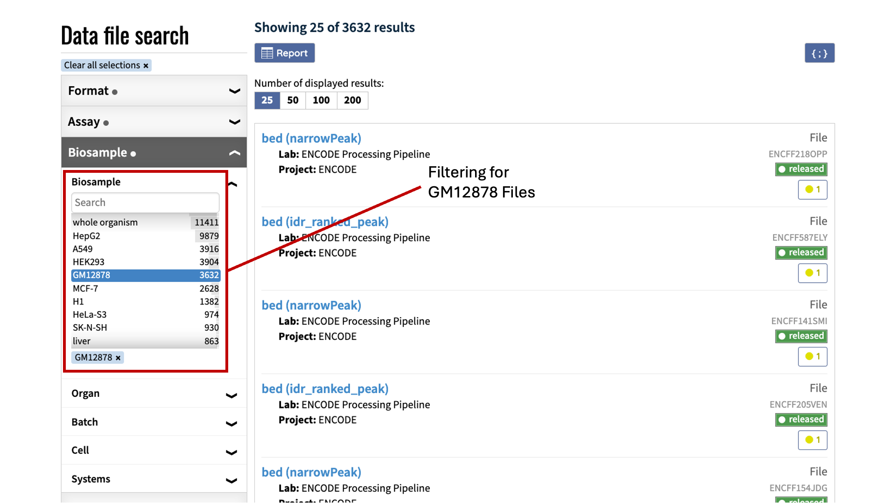
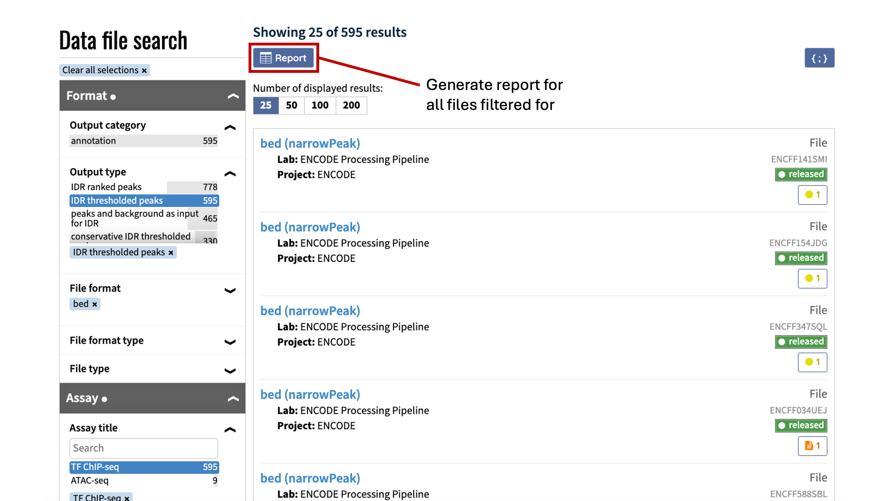
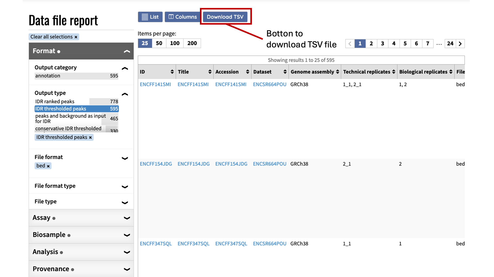
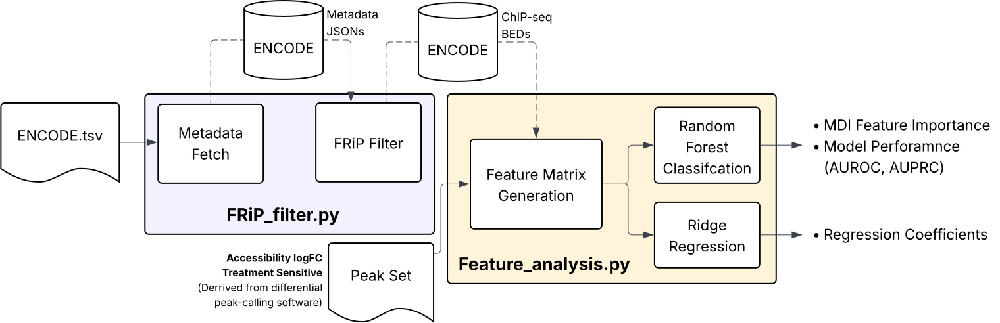

# accessibility-prediction-from-chipseq

## Table of Contents
- [Overview](#Overview)
- [Inputs](#Inputs)
- [Installation](#installation)
- [Pipeline](#pipeline)
- [Usage](#usage)
- [Configuration](#configuration)
- [Outputs](#outputs)

## Overview
This repo contains python scripts used to:
1. Download ChIP-seq BED files from the ENCODE database
2. Train ML models to identify accessible chromatin that respond to drug treatment
3. Conduct feature analyses to understand what features (TF binding/histone mods) best explain the differential response of accessible chromatin elments after treatmet

The ChIP-seq BED files downloaded from ENCODE are filtered for the highest Fraction of Reads in Peaks (FRiP) value within a ChIP target, and the ML modles trained under this pipeline is a Random Forest Clssifier (RFC) and a Ridge Regularized Linear Regression (RR) implemented via the SciKit Learn library.

## Installation
To install, clone this repository:
```bash
# 1. Clone the github repo
git clone https://github.com/aodgulka/accessibility-prediction-from-chipseq.git

# 2. Set current directory to repo
cd ./accessibility-prediction-from-chipseq
```

This pipeline uses a conda environment to manage dependencies. To install with Conda:
```bash
# 1. Create environment (first time only)
conda env create -f environment.yml

# 2. Activate new environment
conda activate accessibility-prediction-from-chipseq

# 3. Change directory into script
cd ./scripts
```
> Execution of scripts in ~/accessibility-prediction-from-chipseq/scripts/ directory is necessary for proper execution.

## Inputs
### There are two main files needed as input for this pipeline:
### 1. ENCODE .tsv file
An ENCODE TSV file is a summary of the ENCODE data file report found on this link: https://www.encodeproject.org/report/?type=File

In the file portal, you can choose filters to narrow down on specific files of interest.


After selecting all filters, click the [Report] button on the top of the page to generate a list of files


After the report has been generated, click the [Download TSV] button to download the final TSV file which includes all files of interest.


The ENCODE TSV can now be used as the input for the FRiP_filter.py script.

### 2. Differential peak calling file

As input for Feature_analysis.py, a .tsv file needs to be provided with individual peaks as rows and two columns:

1. A binary change/no change column
2. A continuous Log Fold Change column

In our examples, we will use differental peak accessibility calls from DESeq2 between control and BAFi treated GM12878 cells which yeild both a change/no_change column and a log fold change column.

## Pipeline
Below is an outline of the pipeline which takes in an ENCODE formatted TSV file,



## Usage
### FRiP and Peak Count Filtering
```bash
# For this demo, a tsv with the following filters from ENCODE was downloaded:
# biosample=GM12878, Output Type=IDR thresholded peaks, File format=bed, Assay Title=TF ChIP-seq, Status=Released, Genome Assembly=GRCh38

python FRiP_filter.py -i "INPUT_ENCODE_TSV_PATH" -t "CHIP-SEQ_TYPE"
```

### To reset the ENCODE Metadata & BED download directory
```bash
python Reset_bed.py 
```

### Random Forest and Linear Regression Feature Analysis
```bash
python Feature_analysis.py -i "PATH_TO_DIFFERENTIAL_PEAK_CALLING_TSV" -fc "FOLD_CHANGE_COLUMN" -d "DIFFERENTIAL_ACCESSIBILITY_COLUMN"
```

## Configuration
### If needed, here are some configurations available for the FRiP_filter script.

While filtering for the highest FRiP value in a target, you can also set a minimum peak number cutoff. For example: 
```bash
python FRiP_filter.py -i ../input/gm12878_tf.tsv -m 1000 
```
will remove all BED files with less than 1000 peaks total, filtering out files with low signal.

Furthermore, if you wish to multithread the BED file downloading process, you can set the numer of threads to use with -p:

```bash
python FRiP_filter.py -i ../input/gm12878_tf.tsv -p 8  # uses 8 threads
```

### For the Feature_analysis script, here are the following configs:
Wile generating the feature matrix, you can choose to exclude samples that overlap with certain features with parameter -x. For example: 
```bash
python Feature_analysis.py -i ../input/differential_peak_accessibility.tsv -fc logfc -d BAFdep -x CTCF
```
will remove any regions that are CTCF bound from the feature matrix

Permutation importance is another form of feature importance which can be calculated from random forests. To calculate adding the option -p:
```bash
python Feature_analysis.py -i ../input/differential_peak_accessibility.tsv -fc logfc -d BAFdep -p
```
will calculate permutation based importance.

Lastly, you can set the number of threads to be used with the -j parameter:
```bash
python Feature_analysis.py -i ../input/differential_peak_accessibility.tsv -fc logfc -d BAFdep -j 4
```
the default number of threads is set to 1. 

## Outputs 
### The following diagram shows the directory paths of generated plots & files: 
```bash

# Under accessibility-prediction-from-chipseq, two subdirectories (scripts and data) exist:

accessibility-prediction-from-chipseq/
├── scripts/
│   └── # python scripts FRiP_filter.py, Feature_analysis.py, and Reset_bed.py. These files should not be altered.
└── data/
    └── # input and output data files


# Under data, three subdrectories (metadata, input, and output) exist

data/
├── metadata/
│   └── # ENCODE ChIP metadata files
├── input/
│   └── # input BED files of Histone and TF ChIP for construction of feature matrix
└── output/
    └── # analysis plots and feature_importance.csv

```
> Execution of Reset_bed.py clears all metadata JSON files and ChIP-seq bed files under metadata and input subdirectories. This is to ensure that both histone ChIP-seq and TF ChIP-seq BED files can be processed even with different data tracking schemes and naming conventions by ENCODE.
